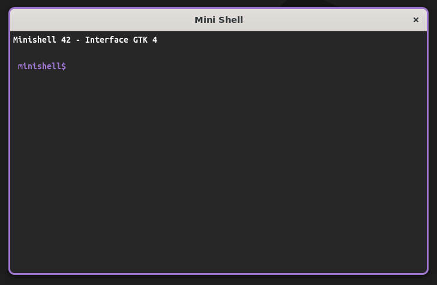

# Mini Shell graphique

Mini Shell réunit une interface graphique GTK 4 et le projet de shell réalisé à 42 par Jordan Busquet et jbossuyt. La fenêtre graphique ne simule pas les commandes : elle lance le véritable exécutable `minishell` comme processus enfant, lui transmet les lignes saisies et affiche sa sortie.



## Fonctionnement

- **Interface GTK 4** : affiche la sortie du shell dans une zone défilante et transmet les commandes saisies avec Entrée.
- **Minishell 42** : conserve le parsing, les builtins, les variables d’environnement, les redirections, les heredocs, les pipes et l’exécution des programmes.
- **Processus persistant** : toutes les commandes d’une session sont envoyées au même processus. Les changements de répertoire (`cd`) et les variables modifiées restent donc actifs d’une commande à l’autre.
- **Flux de données** : GTK écrit dans l’entrée standard du minishell; sa sortie standard et sa sortie d’erreur sont réunies puis affichées dans la fenêtre.

L’interface est une console graphique simple, pas un émulateur de terminal complet. Les applications interactives qui exigent un terminal TTY (par exemple `vim`, `top` ou certains usages de `Ctrl-C`) ne sont pas prises en charge.

## Fonctionnalités du minishell

- Exécution de commandes trouvées dans `$PATH` ou indiquées avec un chemin relatif/absolu.
- Builtins : `cd`, `pwd`, `echo` (option `-n`), `export`, `unset`, `env` et `exit`.
- Expansion des variables (`$VAR`, `$?`) et gestion des guillemets simples/doubles.
- Redirections : `<`, `>`, `>>` et heredoc `<<`.
- Pipes (`|`), y compris les chaînes de plusieurs commandes.
- Historique et gestion des signaux dans le mode terminal classique.

La prise en charge exacte dépend de l’implémentation du minishell 42 incluse dans `minishell/`.

## Prérequis

Le projet est prévu pour un environnement POSIX (Linux/macOS) ou MSYS2 compatible avec les dépendances du projet 42.

- GCC ou Clang, `make` et `pkg-config`.
- GTK 4 et les en-têtes de développement GTK 4.
- GNU Readline et ses en-têtes de développement.
- Un environnement POSIX fournissant notamment `fork`, `execve`, `pipe` et `waitpid`.

Exemples d’installation :

```sh
# Debian / Ubuntu
sudo apt update
sudo apt install build-essential pkg-config libgtk-4-dev libreadline-dev

# Fedora
sudo dnf install gcc make pkgconf-pkg-config gtk4-devel readline-devel

# macOS (Homebrew)
brew install gtk4 readline pkg-config
```

Sous Windows, l’ancienne interface GTK peut être compilée avec MSYS2/UCRT64, mais le shell 42 utilise des appels POSIX (`fork`, `execve`, `waitpid`). Le build combiné nécessite donc un environnement qui fournit réellement ces appels ainsi que GTK 4 et Readline; un compilateur MinGW/UCRT natif seul ne les garantit pas. La compilation combinée n’a pas été validée sous Windows; Linux est l’environnement recommandé.

Si tu utilises **WSL** (comme le montre un chemin `/mnt/c/...`), lance les commandes `apt` et `make` depuis le terminal Ubuntu/WSL, pas depuis PowerShell :

```sh
sudo apt update
sudo apt install build-essential make pkg-config libgtk-4-dev libreadline-dev
pkg-config --modversion gtk4
```

La commande `pkg-config` doit afficher une version de GTK 4. L’erreur `fatal error: gtk/gtk.h: No such file or directory` signifie que les en-têtes de développement GTK 4 ne sont pas installés ou ne sont pas visibles par le compilateur. L’erreur `make: pkg-config: No such file or directory` indique que `pkg-config` manque. Après installation, reconstruis depuis la racine du dépôt :

```sh
make fclean
make
make run
```

Le message `make -C minishell: Nothing to be done for 'all'` n’est pas une erreur : il indique seulement que le minishell 42 était déjà compilé et à jour.

Si la compilation affiche `warning: missing sentinel in function call` pour `g_subprocess_launcher_spawn`, vérifie que l’appel se termine par `executable, NULL`. Le `NULL` termine la liste variadique des arguments du processus; sans lui, le lancement pouvait provoquer un crash.

Si `make run` affiche ensuite des avertissements Mesa/EGL/Zink sous WSL, ils viennent de la couche graphique et ne désignent pas forcément la cause du crash. Mets d’abord le code à jour et reconstruis avec `make fclean && make`, puis relance. Si GTK plante encore, récupère la trace avec `GSK_RENDERER=cairo ./minishell.exe` (pour isoler le rendu GPU) ou `gdb --args ./minishell.exe` puis `run` et `bt` après le crash. N’utilise le renderer Cairo que comme diagnostic/contournement si cela élimine effectivement le crash.

## Compilation et lancement

À la racine de ce dépôt :

```sh
make
make run
```

`make` compile d’abord le minishell dans `minishell/`, puis construit l’interface graphique à la racine. `make run` ouvre la fenêtre et démarre le shell associé. L’interface peut aussi être lancée directement depuis la racine avec `./minishell.exe`.

Le projet 42 reste compilable et lançable sans l’interface :

```sh
make -C minishell
./minishell/minishell
```

Sous Windows, l’exécutable produit par le compilateur peut porter l’extension `.exe`.

## Nettoyage

```sh
make clean   # supprime l'exécutable graphique et les fichiers objets
make fclean  # supprime aussi l'exécutable du shell et la bibliothèque libft
make re      # reconstruit les deux parties
```

Le projet 42 peut également être nettoyé séparément avec `make -C minishell clean`, `fclean` ou `re`.

## Arborescence

```text
Mini Shell/
├── main.c, source/, headers/   # application et interface GTK 4
│   └── minishell_gui.h         # déclarations partagées de l'interface
├── style.css                   # thème de la fenêtre
├── Makefile                    # construit le shell puis l'interface graphique
└── minishell/                  # projet minishell 42 autonome
    ├── src/                    # parsing, AST, builtins, exécution et signaux
    ├── inc/                    # interface interne du shell
    └── libft/                  # bibliothèque libft et fonctions associées
```

## Utilisation

Saisissez directement après le prompt violet `minishell$` dans la zone du terminal, puis appuyez sur Entrée. Il n’y a pas de champ de saisie séparé : la ligne active est à la suite de la sortie, comme dans un terminal classique, et le contenu des lignes déjà validées ne peut plus être modifié. Par exemple :

```sh
echo "Bonjour"
pwd
cd minishell
ls | grep src
export EXEMPLE=42
echo "$EXEMPLE"
```

Les commandes et les réponses restent dans la zone de sortie. Pour un heredoc, le prompt violet `heredoc>` ouvre de la même façon une ligne à saisir dans le terminal; terminez-le en entrant son délimiteur. En mode graphique, le shell envoie des marqueurs internes de prompt, convertis par GTK en prompts violets et lignes de saisie éditables.

## Dépannage

- **GTK 4 introuvable** : vérifiez `pkg-config --modversion gtk4` et que `pkg-config` pointe vers le même environnement que le compilateur.
- **Readline introuvable** : installez ses fichiers de développement; le minishell 42 est lié à `-lreadline`.
- **La fenêtre indique que le shell ne démarre pas** : compilez depuis la racine avec `make` et vérifiez que l’exécutable a été créé dans `minishell/`.
- **Commande inconnue** : vérifiez que le programme est installé et présent dans la variable `$PATH` du processus graphique.

## Contributeurs

- Jordan Busquet
- jbossuyt
